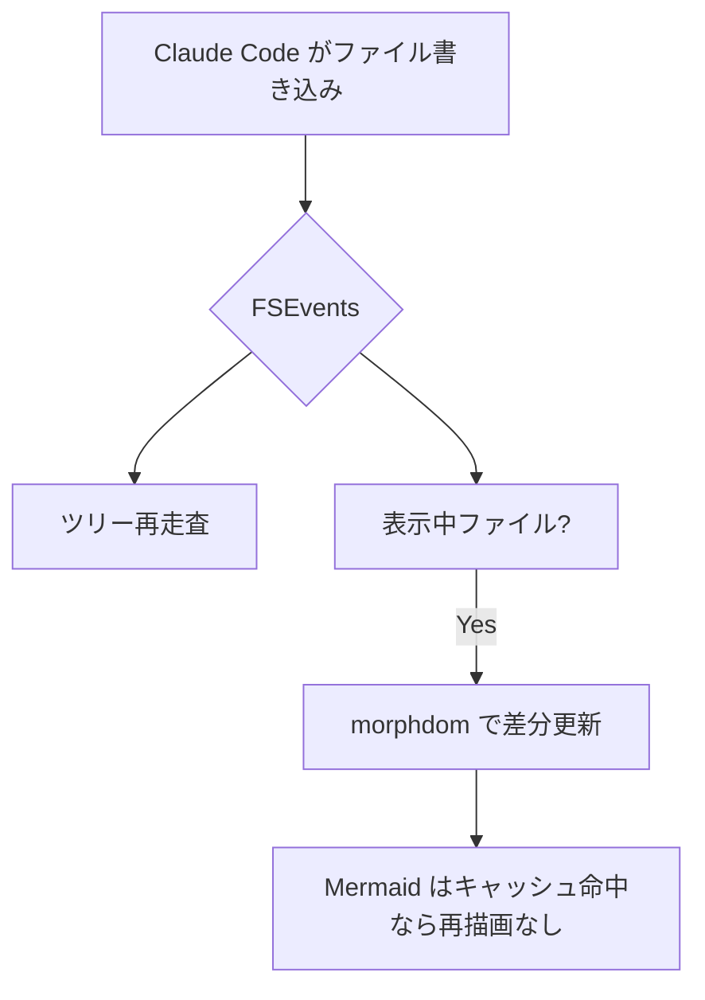
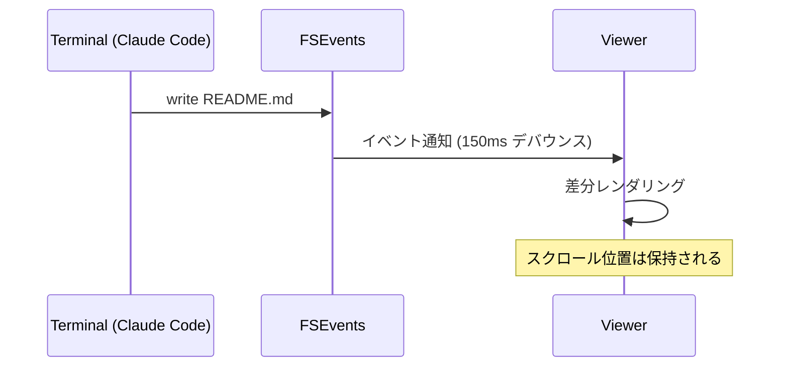

# Mado — レンダリングデモ

これは動作確認用のサンプルです。コード・Mermaid・各種記法の見た目をチェックします。

## コードブロック

```swift
@MainActor
final class AppState: ObservableObject {
    @Published var selectedFile: URL?

    func openFolder(_ url: URL) {
        // FSEvents で再帰監視を開始
        watcher = FSEventsWatcher(path: url.path) { [weak self] paths in
            self?.handleFileSystemEvents(paths)
        }
    }
}
```

```typescript
type FileNode = {
  url: string;
  isDirectory: boolean;
  children?: FileNode[];
};

const scan = async (root: string): Promise<FileNode> => {
  const entries = await fs.readdir(root, { withFileTypes: true });
  return { url: root, isDirectory: true, children: [] };
};
```

インラインコードは `let x = 42` のように表示されます。

## Mermaid





## 表

| 機能 | 状態 | 備考 |
|------|------|------|
| ファイル監視 | ✅ | FSEvents 再帰監視 |
| Mermaid | ✅ | SVG キャッシュ付き |
| シンタックスハイライト | ✅ | highlight.js |
| ダークモード | ✅ | システム連動 |

## タスクリスト

- [x] サイドバー(ツリー表示・トグル可)
- [x] ライブリロード
- [ ] 検索機能(将来)

## アラート

> [!NOTE]
> これは GitHub スタイルのアラートです。

> [!WARNING]
> 表示中のファイルが削除されると表示はクリアされます。

## 引用とリンク

> レンダリングはとにかく速く、美しく。

外部リンクは [既定ブラウザで開きます](https://github.com)。相対リンクは [other.md](other.md) のようにアプリ内で遷移します。

---

最後に数式…は未対応です(KaTeX は将来の拡張ポイント)。
